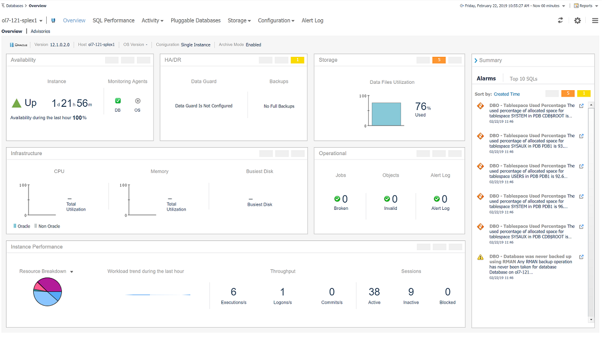
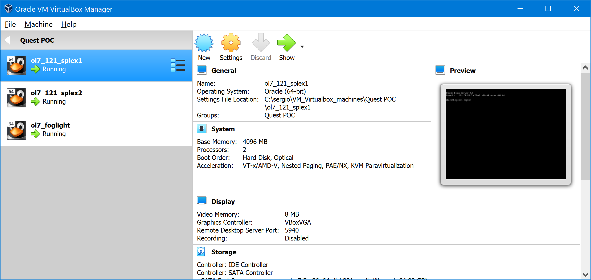

# Vagrant for Quest Shareplex and Foglight to Oracle 12R1 Build

The Vagrant scripts here will allow you to build an Oracle Database 12cR1 and a Shareplex 9.2.0 and Foglight 5.9.2 by just starting the VMs in the correct order.

If you need a more detailed description of this build, check out the article here.


## Required Software

Download and install the following software.

* [VirtualBox](https://www.virtualbox.org/wiki/Downloads)
* [Vagrant](https://www.vagrantup.com/downloads.html)
* Git client (not mandatory). You can download manually and unzip the file.
* [Oracle 12R1](https://www.oracle.com/technetwork/database/enterprise-edition/downloads/database12c-linux-download-2240591.html)
* [Shareplex 9.2.0](https://support.quest.com/en-US/Login?kc_locale=en-US&dest=%2fshareplex%2f9.2.1%2fdownload-new-releases%3fstarted%3d6093403)
* [Foglight for Databases](https://support.quest.com/fr-FR/Login?kc_locale=fr-FR&dest=%2ffr-fr%2ffoglight-for-databases%2f5.9.3%2fdownload-new-releases%3fstarted%3d6093819)
* [Foglight Cartridge for Oracle](https://support.quest.com/fr-FR/Login?kc_locale=fr-FR&dest=%2ffr-fr%2ffoglight-for-databases%2f5.9.3%2fdownload-new-releases%3fstarted%3d6093814)
* [Foglight licenses](https://support.quest.com/fr-fr/contact-us/licensing)


## Clone Repository

Pick an area on your file system to act as the base for this git repository and issue the following command. If you are working on Windows remember to check your Git settings for line terminators. If the bash scripts are converted to Windows terminators you will have problems.

```
git clone https://github.com/SergioRomera/quest.git
```

Copy the software under the "quest" directory. From the "quest" directory, the structure should look like this.

```
tree
.
│   README.md
│
├───config
│       install.env
│       vagrant.yml
│
├───node1
│   │   Vagrantfile
│   └───scripts
│           oracle_create_database.sh
│           oracle_user_environment_setup.sh
│           root_setup.sh
│           setup.sh
│
├───node2
│   │   Vagrantfile
│   └───scripts
│           oracle_create_database.sh
│           oracle_user_environment_setup.sh
│           root_setup.sh
│           setup.sh
│
├───node4_foglight
│   │   Vagrantfile
│   └───scripts
│           foglight_setup.sh
│           root_setup.sh
│           setup.sh
│       
│
├───shared_scripts
│       configure_chrony.sh
│       configure_hostname.sh
│       configure_hostname_postgres.sh
│       configure_hosts_base.sh
│       configure_shared_disks.sh
│       install_os_packages.sh
│       oracle_auto_startdb.sh
│       oracle_db_software_installation.sh
│       prepare_u01_disk.sh
│       shareplex_create_test_table.sh
│       shareplex_functions.sh
│       shareplex_install.sh
│       shareplex_install_postgres_config.sh
│       shareplex_install_windows.sql
│       tables_samples.sql
│
└───software
    │   Foglight-5_9_4-Server-linux-x86_64-b7.zip
    │   linuxamd64_12102_database_1of2.zip
    │   linuxamd64_12102_database_2of2.zip
    │   put_software_here.txt
    │   SharePlex-9.2.0-b42-oracle120-rh-40-amd64-m64.tpm
    │   shareplex_customer_name.txt
    │   shareplex_licence_key.txt
    │   SPX-9.2.0-b42-oracle110-rh-40-amd64-m64.tpm
    │
    ├───foglight
    │   │   fms_silent_install.properties
    │   │
    │   ├───foglight_cartridges
    │   │   │   DB_Oracle-5_9_3_20.car
    │   │   │   Infrastructure-5_9_4.car
    │   │   │
    │   │   └───DB_Oracle_CLI_Installer
    │   │           DBO_check_permissions.sql
    │   │           DBO_granting_permissions.sql
    │   │           oracle_cli_installer.groovy
    │   │           oracle_cli_installer_input_template.csv
    │   │           README.txt
    │   │
    │   └───foglight_licenses
    │           put_foglight_licenses_here.txt
    │
    ├───Server
    │   └───FoglightServer-5_9_4
    │           fms_silent_install.properties
    │           Foglight-5_9_4-install_linux-x86_64.bin
    │           FoglightAgentManager_5.9.4_DevKitReleaseNotes.html
    │           FoglightAgentManager_5.9.4_ReleaseNotes.html
    │           Foglight_5.9.4_ReleaseNotes.html
    │
    └───shareplex
            put_shareplex_software_here.txt
            SharePlex-9.2.0-b42-oracle120-rh-40-amd64-m64.tpm
            SPX-9.2.0-b42-oracle110-rh-40-amd64-m64.tpm

```

## Licences
Shareplex and Foglight require licenses. This step is mandatory. Put your licenses in this 2 directories:

* Shareplex license

```
└───software
        shareplex_customer_name.txt
        shareplex_licence_key.txt
```

* Foglight license

Put your *.license files in this directory. You can obtain your licences from [licences](https://support.quest.com).

```
└───software
    ├───foglight
    │   ├───foglight_licenses
    │   │   │   put_foglight_licenses_here.txt
```
* Foglight cartridge

Copy your cartridge files in this directory:

```
.
│
└───software
    ├───foglight
    │   ├───foglight_cartridges
    │   │   │   DB_Oracle-5_9_3_20.car
    │   │   │   Infrastructure-5_9_4.car
```

## Build the Shareplex System

The following commands will leave you with a functioning Shareplex installation.

Modify this files with the correct licence information:

```
└───software
    │   shareplex_customer_name.txt
    │   shareplex_licence_key.txt
```

Start the first node and wait for it to complete. This will create the primary database.

```
#Primary Oracle DB
cd node1
vagrant up
```

Start the second node and wait for it to complete. This will create the second database.

```
#Secondary Oracle DB
cd ../node2
vagrant up
```

## Build the Foglight System

The following commands will leave you with a functioning Foglight installation.

* Copy the Foglight software into the vagrant_software folder:

```
└───software
        Foglight-5_9_4-Server-linux-x86_64-b7.zip
```

Start the forth node and wait for it to complete.

```
cd ../node4
vagrant up
```


## Turn Off System

Perform the following to turn off the system cleanly.

```
cd ../node4
vagrant halt

cd ../node3
vagrant halt

cd ../node2
vagrant halt

cd ../node1
vagrant halt
```

## Remove Whole System

The following commands will destroy all VMs and the associated files, so you can run the process again.

```
cd ../node4
vagrant destroy -f

cd ../node3
vagrant destroy -f

cd ../node2
vagrant destroy -f

cd ../node1
vagrant destroy -f
```

## Shareplex configuration
User test is replicated. Here the shareplex configuration:

```
datasource:o.pdb1
#source tables      target tables           routing map
expand test.%       test.%                  ol7-121-splex2@o.pdb1

```

## Architecture







# POC
Schema test in pdb1 database is replicated.
Test table is created in pdb1 database in Node 1 with 1 record. This record is replicated in Node 2.
You can create other objects in Node 1 that will be replicated in Node 2.
Foglight will monitor all the activity of this 2 servers.

